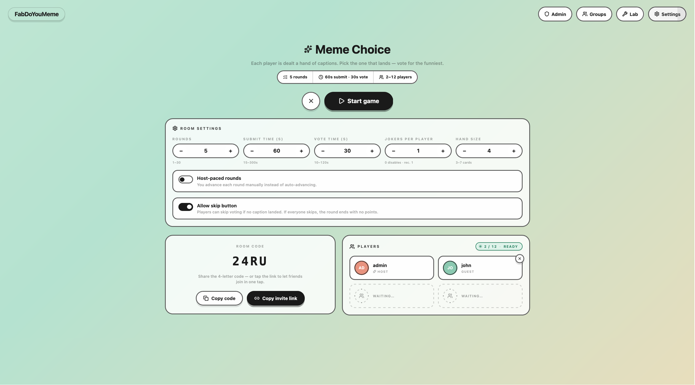
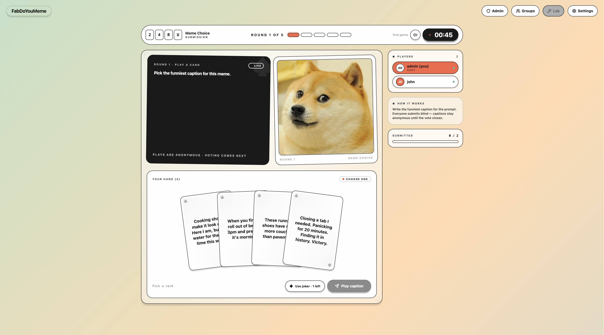
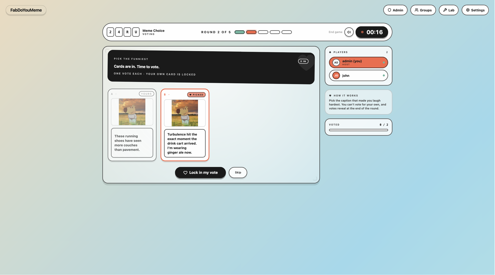
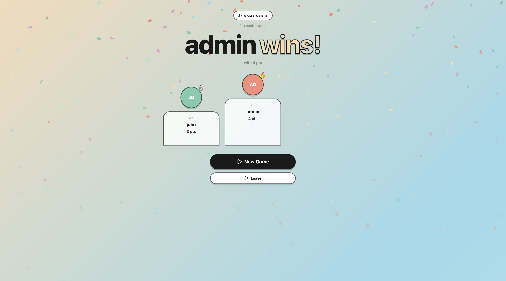

<!-- TODO(media): replace placeholder with a real banner exported to docs/assets/banner.png (recommended: 1280×320, transparent or dark background, logo left + tagline right). -->

# FabDoYouMeme

**A self-hosted, invite-only party game platform for friends who don't want to hand their data to a SaaS.**

---

> [!IMPORTANT]
> **If you self-host this, you are the GDPR data controller for your instance.**
> FabDoYouMeme stores usernames, emails, and game history. When you run it, you — not the upstream project — are legally responsible for lawful processing, data subject requests (access, erasure, portability), breach notification, and publishing a privacy policy at `/privacy`. The defaults are designed to help (consent capture, export endpoint, admin-driven erasure, retention windows), but they don't absolve you of the obligations.
>
> Read before deploying to real users: [`docs/reference/gdpr.md`](docs/reference/gdpr.md) (compliance model) and [`docs/reference/privacy-policy.md`](docs/reference/privacy-policy.md) (Art. 13(1) stub to fill in).

---

## Why this exists

Commercial party-game platforms ask for accounts, track sessions, and monetise attention. None of that is required to caption a meme with four friends on a Friday night. FabDoYouMeme exists because a night of laughter shouldn't need a privacy policy you don't control.

It runs entirely on hardware you already own — one Docker Compose stack on a spare machine, a home server, or a small VPS. Invitations are one-time tokens; there is no public registration. Nobody joins that you didn't let in. When the game is over, the data is still yours.

It is also built to be **extended**, not just played. The game engine is a plugin architecture: new game types (trivia, drawing duels, pairs, quickfire) slot in as registered handler units without database or protocol changes. Meme captioning is the first type shipped; it is not meant to be the last.

---

## What you get

**For players**

- Join a room with a short code — no account, no app install, no download
- Caption the round, vote on the funniest, see the leaderboard climb
- Reconnect cleanly if your WiFi drops mid-round (30-second grace window by default)

**For the host (game admin)**

- Create rooms, pick a pack, kick off rounds; everything is in-browser
- Invite-only tokens with per-email restrictions if you want to pre-assign seats
- Content packs managed from a dedicated admin panel — upload media, build decks

**For the self-hoster (operator)**

- One Docker Compose stack. One reverse proxy. One `.env` file. That's the install surface.
- PostgreSQL 17 + RustFS (S3-compatible) for state and assets
- Magic-link auth only — no passwords to rotate, leak, or forget
- Prometheus-friendly `/api/metrics`, structured JSON logs, request IDs
- Built-in GDPR primitives: consent capture, data export, admin-driven erasure, sentinel-UUID anonymisation, retention windows
- Multi-game extensibility — add a new game type in one Go file, zero schema or protocol changes

---

## See it in action

<!-- TODO(media): replace the placeholders below with real screenshots. Suggested set:
     1. Lobby / room join (desktop + mobile)
     2. Caption submission phase (timer visible)
     3. Vote phase with submitted captions
     4. Results / leaderboard
     5. Admin panel — pack management
     Recommended path: docs/assets/screenshots/*.png -->

|                                                         |                                                               |
| :-----------------------------------------------------: | :-----------------------------------------------------------: |
|  |  |
|    **Lobby** — room code, player list, host controls    |        **Submit** — caption the round against a timer         |
|  |    |
|  **Vote** — pick the funniest, anonymous until reveal   |        **Results** — round score + running leaderboard        |

> **Prefer a moving demo?** A 30-second loop is planned at `docs/assets/demo.gif`. _Coming soon._

---

## How it works

FabDoYouMeme is a **Go backend** (HTTP + WebSocket) plus a **SvelteKit frontend** (`adapter-node`), both shipped as minimal Docker images and wired together with a pre-existing reverse proxy. A single PostgreSQL 17 database holds game state; RustFS (S3-compatible) holds uploaded assets. There is no message broker, no cache layer, no background job runner — ADR-005 in [`docs/reference/decisions.md`](docs/reference/decisions.md) explains why that's a feature, not a shortcut.

The **game engine** is a per-room goroutine owned by a WebSocket hub. Each room transitions through a fixed lifecycle — `lobby → countdown → submission → voting → results → next round → game over` — and broadcasts phase changes over a shared protocol. Game-type handlers (implementations of `GameTypeHandler`) plug into this lifecycle without touching it. The [`docs/game-engine.md`](docs/game-engine.md) doc walks through the full handler contract and room/round state machine.

**Authentication** is magic-link only. Registration takes a one-time invite token, a username, an email, and two consent checkboxes. Login sends a 15-minute, single-use token by email; the database stores only its SHA-256 hash. Sessions are opaque, DB-backed, and revocable by deleting a row. Nothing crackable lives on disk. Deeper security details are in [`docs/auth-and-identity.md`](docs/auth-and-identity.md) and [`SECURITY.md`](.github/SECURITY.md).

---

## Try it

Everything you need to run an instance — prerequisites, environment variables, first-boot procedure, production deployment — is consolidated in **[`docs/self-hosting.md`](docs/self-hosting.md)**. That document is the single source of truth for installation; this README intentionally does not duplicate it.

Short version for the impatient: you need Docker, a reverse proxy that routes `/api/*` to the backend and `/*` to the frontend, an SMTP server for magic-link delivery, and a reachable RustFS instance. Copy the stage template for your environment (e.g. `cp .env.dev.example .env.dev`), fill in the values, `make dev` (or `make preprod` / `make prod`), click the magic link that lands in your inbox on first boot. You are the admin.

---

## Security posture

Self-hosted does not mean security-by-obscurity. The things that matter to a small-scale party-game platform, handled explicitly:

- **No passwords.** Authentication is magic-link only. Credential stuffing, reuse, and storage-breach risk are removed entirely rather than mitigated.
- **Magic-link tokens are hashed.** Only SHA-256 digests hit the database; a DB leak yields nothing crackable. Tokens are single-use and expire in 15 minutes.
- **Sessions are revocable in one SQL statement.** Unlike JWTs, there is no signing key to rotate and no grace period on logout — `DELETE FROM sessions WHERE id = …` is immediate and total.
- **Rate limiting on every auth-adjacent surface.** Registration attempts, magic-link requests, room creation, upload URL grants, and generic API traffic all have per-IP or per-user caps. Defaults live in [`docs/self-hosting.md`](docs/self-hosting.md).
- **WebSocket frame limits, origin checks, and per-connection rate limits.** The hub drops clients that exceed 20 messages/s or 4 KB frames; origin validation prevents cross-site hijacking.
- **Upload validation is two-layer.** MIME type _and_ magic-byte inspection; the frontend never receives a direct asset URL for a client-chosen key.
- **Invite-only by design.** There is no public registration endpoint. Every user enters through an admin-issued, optionally email-restricted token.
- **CodeQL scanning on every push** plus `govulncheck` and `npm audit` via CI. Dependabot is enabled for every ecosystem the repo touches.
- **Responsible disclosure:** see [`.github/SECURITY.md`](.github/SECURITY.md) for the private reporting channel and SLA.

The security model is intentionally scoped to a single-host deployment. Multi-instance hardening (externalised rate limits, distributed session store) is explicitly out of scope — see ADR-005.

---

## Privacy & GDPR

FabDoYouMeme is built to be deployable in the EU without legal retrofitting. Every instance ships with:

- **Registration gated on explicit consent** — `consent: true` and `age_affirmation: true` are mandatory; `users.consent_at` is written once and never updated.
- **A first-class data export endpoint** — `GET /api/users/me/export` returns a complete, machine-readable JSON dump for Art. 20 portability requests.
- **Admin-driven erasure with referential integrity** — hard-deletion replaces `submissions.user_id` and `votes.voter_id` with a sentinel UUID before removing the user row, so round integrity survives without leaking personal data.
- **Retention windows** — game data is purged 2 years after game end; audit-log PII is anonymised after 3 years; magic-link tokens are cleaned 7 days after use.
- **An Art. 13(1) privacy-policy template** at [`docs/reference/privacy-policy.md`](docs/reference/privacy-policy.md) that operators fill in once and serve at `/privacy`.

The full compliance model — lawful basis, ROPA-lite, data-subject rights, processor list, breach procedure — is documented in [`docs/reference/gdpr.md`](docs/reference/gdpr.md). Read it **before** going live with real users; GDPR obligations attach to the operator (you), not the upstream project.

---

## Built with AI, reviewed by a human

This project was developed collaboratively with AI coding assistants (primarily Claude Code) as pair-programming tooling. That's worth being up-front about, so you can weigh it against your own risk tolerance. The working agreement throughout has been:

- **Every change reviewed by a human** before commit. AI assistance accelerates exploration and boilerplate — it does not ship unsupervised.
- **The same CI gates apply regardless of origin.** `go vet`, `go test -race`, `npm run check`, CodeQL, `govulncheck`, and `npm audit` run on every push. An AI-generated line and a hand-typed line survive or fail on the same criteria.
- **Security-sensitive surfaces carry `CODEOWNERS` review.** The auth, middleware, and server-wire-up paths require explicit review on every PR ([`.github/CODEOWNERS`](.github/CODEOWNERS)).
- **Contributor AI policy is explicit.** [`.github/CONTRIBUTING.md`](.github/CONTRIBUTING.md) states what's acceptable: AI-assisted PRs are welcome, untested AI-generated PRs are not.

If you find an issue — AI-introduced or otherwise — the disclosure channel is the same: [`.github/SECURITY.md`](.github/SECURITY.md) for vulnerabilities, the issue tracker for everything else.

---

## Documentation

Full design documentation lives in [`docs/`](docs/):

| Doc                                                                    | Contents                                                         |
| ---------------------------------------------------------------------- | ---------------------------------------------------------------- |
| [`docs/overview.md`](docs/overview.md)                                 | Goals, tech stack rationale, key design decisions                |
| [`docs/architecture.md`](docs/architecture.md)                         | System components, DB schema, storage, middleware, startup       |
| [`docs/auth-and-identity.md`](docs/auth-and-identity.md)               | Auth flow, invite system, session management, security controls  |
| [`docs/game-engine.md`](docs/game-engine.md)                           | Room/round lifecycle, WebSocket hub, game type handler interface |
| [`docs/api.md`](docs/api.md)                                           | REST endpoints, WebSocket protocol, error model                  |
| [`docs/frontend.md`](docs/frontend.md)                                 | SvelteKit routing, Svelte 5 state singletons, game plugin arch   |
| [`docs/self-hosting.md`](docs/self-hosting.md)                         | Prerequisites, first boot, all environment variables             |
| [`docs/operations.md`](docs/operations.md)                             | Monitoring, logs, backups, CI, production checklist              |
| [`docs/reference/error-codes.md`](docs/reference/error-codes.md)       | Canonical `snake_case` error code table (REST + WebSocket)       |
| [`docs/reference/decisions.md`](docs/reference/decisions.md)           | ADR-001–ADR-010 architectural decisions                          |
| [`docs/reference/gdpr.md`](docs/reference/gdpr.md)                     | GDPR compliance: lawful basis, rights, DPA, breach procedure     |
| [`docs/reference/privacy-policy.md`](docs/reference/privacy-policy.md) | Art. 13(1) Privacy Policy stub template for operator to complete |

---

## Contributing

Issues, feature requests, and pull requests are welcome. Please read [`.github/CONTRIBUTING.md`](.github/CONTRIBUTING.md) first — it covers when to open an issue vs. go straight to a PR, the tests and CI checks you need to pass, and what won't get merged.

Proposing a **new game type**? There is a dedicated [issue template](.github/ISSUE_TEMPLATE/game-type-proposal.yml) for that; it asks the right questions for the plugin architecture (slug, round structure, WS messages, scoring, asset needs, player range). Read [`docs/game-engine.md`](docs/game-engine.md) before filling it in.

## Code of conduct

All participation — issues, PRs, discussions — is governed by the short, readable [`.github/CODE_OF_CONDUCT.md`](.github/CODE_OF_CONDUCT.md). Roughly: keep it technical, be specific, own your mistakes, and don't make the project hostile. Reports go to `contact@libresoftware.cloud`.

## License

FabDoYouMeme is released under the **[GNU General Public License v3.0](LICENSE)**. In plain English, that means you are free to:

- **Run it**, for any purpose, personal or commercial
- **Study it**, inspect every line of how it works, and learn from it
- **Modify it**, fork it, customise it, add your own game types, rewire the frontend
- **Redistribute it**, share your changes with friends, run it on someone else's machine

With one obligation: **derivatives must stay GPLv3**. If you ship a modified version — privately hosted, publicly hosted, or redistributed — the people you ship it to get the same rights you did, and the source has to be available to them. That's the copyleft bargain, and it's the entire reason this is GPLv3 and not MIT: a game meant to protect its players from SaaS capture should not be legally easy to turn into SaaS capture.

Full text: [`LICENSE`](LICENSE). Human-readable summary: [choosealicense.com/licenses/gpl-3.0/](https://choosealicense.com/licenses/gpl-3.0/).
